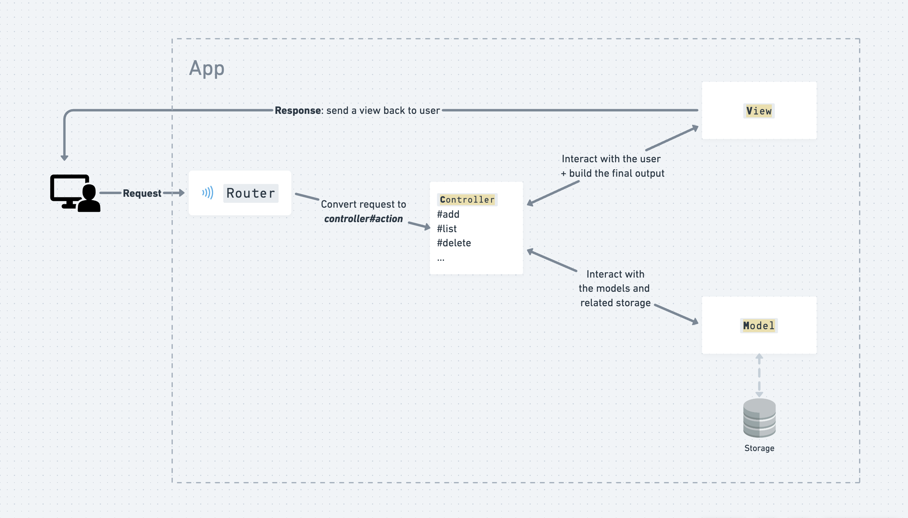

# Cookbook Reboot

Let’s do a correction of the Cookbook!

During this livecode, we will review together the first Cookbook challenge and focus on the core concepts of the MVC pattern:



## Usage

To download the folder, open your terminal and run the following commands:

```sh
cd ~/code/$(gh api user | jq -r '.login')
sh -c "$(curl -s https://raw.githubusercontent.com/gabrielecanepa/lewagon/main/download.sh)" -- camps/1586/livecodes/cookbook-reboot
cd cookbook-reboot
code . # open in vscode
```

Run the application with:

```sh
ruby lib/app.rb
```


