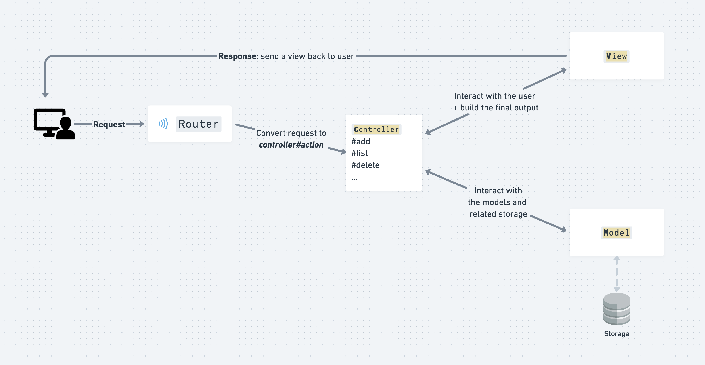

# OOP To-Do List

To prepare for the Cookbook challenge, let's create a simple task manager to demonstrate the MVC pattern with a command line app.

## Usage

Download this folder:

```sh
sh -c "$(curl -s https://raw.githubusercontent.com/gabrielecanepa/lewagon/main/download.sh)" -- lectures/oop/03-cookbook oop-todolist
cd oop-todolist
```

And run with:

```sh
ruby lib/app.rb
```

Then hit `Ctrl-C` to quit the program. You'll lose all your todos!

## Details



Architecture:
- Model: `Task`
- View: `TasksView`
- Controller: `TasksController`

We fake the database with `TaskRepository` and the browser with `Router`.
